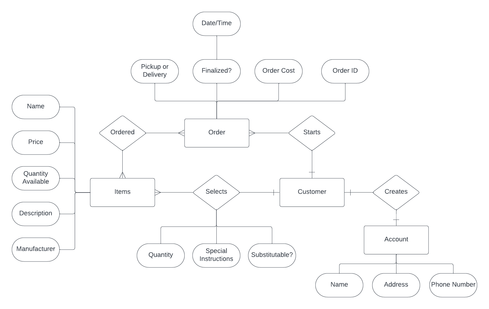
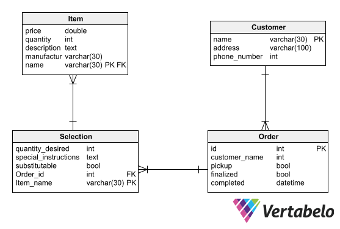

This lab was a little tough, and I'm not entirely sure if I got the full picture, as I definitely struggle with envisioning things as entity relationship diagrams. Specifically, I find it hard to isolate things as entities and I'm not always sure I made the right choice.
For the LucidChart ERD, I decided that I should set the following things as entities: Customer, Account, Order, and Items. This made sense because the customer's account seems to hold more information than the customer itself, and items and orders were obviously necessary details. I have included the .png file here:

For the Vertabelo SQL database, I decided that the account was not necessary as part of the table, so I did away with it and added the information to the customer table. I also added a selection table to handle the interaction between items and orders. I have included the .png file for the Vertabelo picture here:

I believe these two diagrams should be correct, and I don't think there are any issues with them.